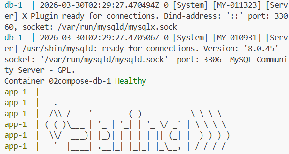

# 🐳 Docker Healthcheck 실습

## 📁 프로젝트 구조

```
02.compose/
├── docker-compose.yml
├── Dockerfile
└── *.jar
```

---

## ⚙️ 설정

### docker-compose.yml

```yaml
services:
  db:
    image: mysql:8.0
    restart: always
    ports:
      - "3306:3306"
    environment:
      MYSQL_ROOT_PASSWORD: root
      MYSQL_DATABASE: fisa
      MYSQL_USER: user01
      MYSQL_PASSWORD: user01
    volumes:
      - db_data:/var/lib/mysql
    networks:
      - spring-mysql-net
    healthcheck:
      test: ["CMD-SHELL", "mysqladmin ping -h localhost -u root -p$$MYSQL_ROOT_PASSWORD || exit 1"]
      interval: 10s
      timeout: 5s
      retries: 10
      start_period: 30s

  app:
    build:
      context: .
      dockerfile: Dockerfile
    ports:
      - "80:8086"
    environment:
      MYSQL_HOST: db
      MYSQL_PORT: 3306
      MYSQL_DATABASE: fisa
      MYSQL_USER: user01
      MYSQL_PASSWORD: user01
      SPRING_DATASOURCE_URL: jdbc:mysql://db:3306/fisa
      SPRING_DATASOURCE_USERNAME: user01
      SPRING_DATASOURCE_PASSWORD: user01
    depends_on:
      db:
        condition: service_healthy
    networks:
      - spring-mysql-net

volumes:
  db_data:

networks:
  spring-mysql-net:
```

### Dockerfile

```dockerfile
# Base Image 설정
FROM eclipse-temurin:17-jre-jammy

# curl 설치
RUN apt-get update \
 && apt-get install -y curl \
 && apt-get clean \
 && rm -rf /var/lib/apt/lists/*

# 작업 디렉토리 설정
WORKDIR /app

# 애플리케이션 JAR 파일 복사
COPY *.jar app.jar

# 환경 변수 설정
ENV SERVER_PORT=8086

# 헬스 체크 설정
HEALTHCHECK --interval=10s --timeout=30s --retries=3 \
  CMD curl -f http://localhost:8086/emp/deptall || exit 1

# 애플리케이션 실행
ENTRYPOINT ["java", "-jar", "app.jar"]
```

---

## 🔍 Healthcheck 설정 위치

| 설정 위치 | 역할 |
|---|---|
| `docker-compose.yml` | **DB 자체**가 정상인지 체크 (`mysqladmin ping`) |
| `Dockerfile` | **앱이 DB까지 연결해서** 실제로 동작하는지 체크 (`curl`) |

## Healthcheck 확인 방법

```bash
# db healthcheck 상태
docker inspect --format='{{json .State.Health}}' 02compose-db-1 | python3 -m json.tool

# app healthcheck 상태
docker inspect --format='{{json .State.Health}}' 02compose-app-1 | python3 -m json.tool
``` 

---

## 🧪 실험 1: 정상 실행 및 시작 순서 확인

### 목적
`depends_on: condition: service_healthy` 설정으로 db가 healthy 상태가 된 후에만 app이 시작되는지 확인

### 실행
```bash
docker compose down -v
docker compose up
```

### 결과 (로그 타임스탬프 기준)



db-Healthy 이후에 app이 실행되는 것을 확인할 수 있다.

### 소요시간 분석

| 구간 | 소요시간 |
|---|---|
| db 시작 → db healthy | 약 7초 |
| db healthy → app 시작 | 약 0.4초 (거의 즉시) |
| app 시작 → app 완전히 뜸 | 약 6초 |
| **전체 총 소요시간** | **약 13초** |

### 고찰
- db가 healthy 판정을 받는 순간 app이 즉시 실행됨
- healthcheck가 없었다면 db 초기화 중에 app이 먼저 떠서 DB 연결 실패로 죽었을 것

---

## 🧪 실험 2: db unhealthy 시 app 생성 여부 확인

### 목적
db가 unhealthy 상태일 때 app 컨테이너가 아예 생성조차 안 되는지 확인

### 실행
`docker-compose.yml` healthcheck를 일부러 실패하도록 수정:
```yaml
healthcheck:
  test: ["CMD", "exit", "1"]   # 항상 실패
```

```bash
docker compose down -v
docker compose up -d
watch docker compose ps
```

### 결과


db가 healthy가 되기 전까지 app이 절대 뜨지 않는 것을 확인

### 고찰
- `condition: service_healthy` 덕분에 db가 unhealthy인 동안 app 실행이 완전히 차단됨
- `condition: service_started`였다면 db 프로세스만 시작돼도 app이 실행됐을 것

> 실험 후 healthcheck 원래대로 복구 필수!

---

## 🧪 실험 3: 운영 중 DB 중단 시 app 동작 확인

### 목적
운영 중 db가 죽었을 때 app 컨테이너와 API 요청이 어떻게 되는지 확인

### 실행
```bash
# 1단계: 정상 상태에서 API 확인
curl http://localhost:80/emp/deptall
# 결과: []

# 2단계: db 중단
docker stop 02compose-db-1

# 3단계: 같은 API 다시 호출
curl http://localhost:80/emp/deptall
```
3단계 결과:


500 에러가 뜨는 것을 확인


### 결과

| 상태 | curl 결과 | app 컨테이너 |
|---|---|---|
| db 살아있을 때 | `[]` 즉시 응답 | running (healthy) |
| db 중단 후 | 500에러가 뜸 |

### 고찰
- `depends_on: condition: service_healthy`는 **최초 시작 순서만 보장**
- 운영 중 DB가 죽으면 app 컨테이너는 살아있지만 실제 요청은 처리 불가
- app의 HEALTHCHECK가 DB 연결 실패를 감지해 `unhealthy` 상태로 변함
- 운영 환경에서는 앱 레벨의 재연결 로직(retry, circuit breaker 등)이 추가로 필요

---

## 🧪 실험 4: DB 재시작 후 app 자동 복구 확인

### 목적
DB가 다시 살아났을 때 app이 자동으로 healthy 상태로 돌아오는지 확인

### 실행

**db중단하기 전 상태**


모두 healthy인 것을 확인

<br>

**db만 중단했을 때**

```bash
docker compose stop db
```


app의 상태가 unhealthy인 것을 확인

**다시 db를 실행**

```bash
docker compose up -d db
```


app의 상태가 다시 healthy로 바뀐 것을 확인

### 고찰
- Dockerfile HEALTHCHECK가 `interval: 10s`마다 계속 실행되고 있음
- DB가 살아나면 다음 healthcheck 주기에 자동으로 `healthy`로 복구됨
- **app을 재시작하지 않아도** DB 연결이 자동으로 복구됨

---

## 📋 Healthcheck 역할 최종 정리

| | `docker-compose.yml` healthcheck | `Dockerfile` healthcheck |
|---|---|---|
| 체크 대상 | DB 자체 (`mysqladmin ping`) | 앱 + DB 연결 (`curl /emp/deptall`) |
| 역할 | app 시작 조건 판단 | 앱의 실제 동작 상태 모니터링 |
| 영향 | app 컨테이너 생성 여부 결정 | 컨테이너 healthy/unhealthy 상태 표시 |

---

## 🔥 트러블슈팅

### 1. `UnknownHostException: mysqldb`

**증상**
```
Caused by: java.net.UnknownHostException: mysqldb
```

**원인**

`application.properties`에 DB 호스트명이 하드코딩되어 있었음
```properties
spring.datasource.url=jdbc:mysql://mysqldb:3306/fisa  # mysqldb로 하드코딩
```
docker-compose.yml에서 넘긴 `MYSQL_HOST: db`를 읽지 않고 있었음

**해결**

`docker-compose.yml`에 Spring 환경변수 직접 주입:
```yaml
environment:
  SPRING_DATASOURCE_URL: jdbc:mysql://db:3306/fisa
  SPRING_DATASOURCE_USERNAME: user01
  SPRING_DATASOURCE_PASSWORD: user01
```

또는 `application.properties` 수정 후 재빌드:
```properties
spring.datasource.url=jdbc:mysql://${MYSQL_HOST}:${MYSQL_PORT}/${MYSQL_DATABASE}
spring.datasource.username=${MYSQL_USER}
spring.datasource.password=${MYSQL_PASSWORD}
```

---

### 2. `Access denied for user 'user01'`

**증상**
```
Access denied for user 'user01'@'172.19.0.3' (using password: YES)
```

**원인**

`db_data` 볼륨에 이전에 다른 비밀번호로 초기화된 데이터가 남아있어서 새 환경변수가 무시됨. MySQL은 볼륨이 이미 존재하면 `MYSQL_PASSWORD` 환경변수를 다시 적용하지 않음

**해결**
```bash
docker compose down -v    # 볼륨까지 완전히 삭제
docker compose up -d      # 새로 초기화
```

---

### 3. `openjdk:17-slim: not found`

**증상**
```
failed to solve: openjdk:17-slim: not found
```

**원인**

`openjdk` 공식 Docker 이미지가 deprecated됨

**해결**

Dockerfile 베이스 이미지 변경:
```dockerfile
# 변경 전
FROM openjdk:17-slim

# 변경 후
FROM eclipse-temurin:17-jre-jammy
```

---

### 4. app healthcheck null (HEALTHCHECK 미반영)

**증상**
```bash
docker inspect --format='{{json .State.Health}}' 02compose-app-1
# 결과: null
```

**원인**

Dockerfile을 수정했지만 `docker compose build`를 하지 않아 이전 이미지가 그대로 사용됨

**해결**
```bash
docker compose down
docker compose build app   # 반드시 재빌드
docker compose up -d
```

---

### 5. app 포트 접속 불가 (사이트에 연결할 수 없음)

**증상**

`http://localhost/emp/deptall` 접속 시 연결 불가

**원인**

앱은 `8086` 포트로 실행되는데 docker-compose.yml이 `80->8080`으로 잘못 매핑되어 있었음

**해결**

docker-compose.yml 포트 수정:
```yaml
ports:
  - "80:8086"
```